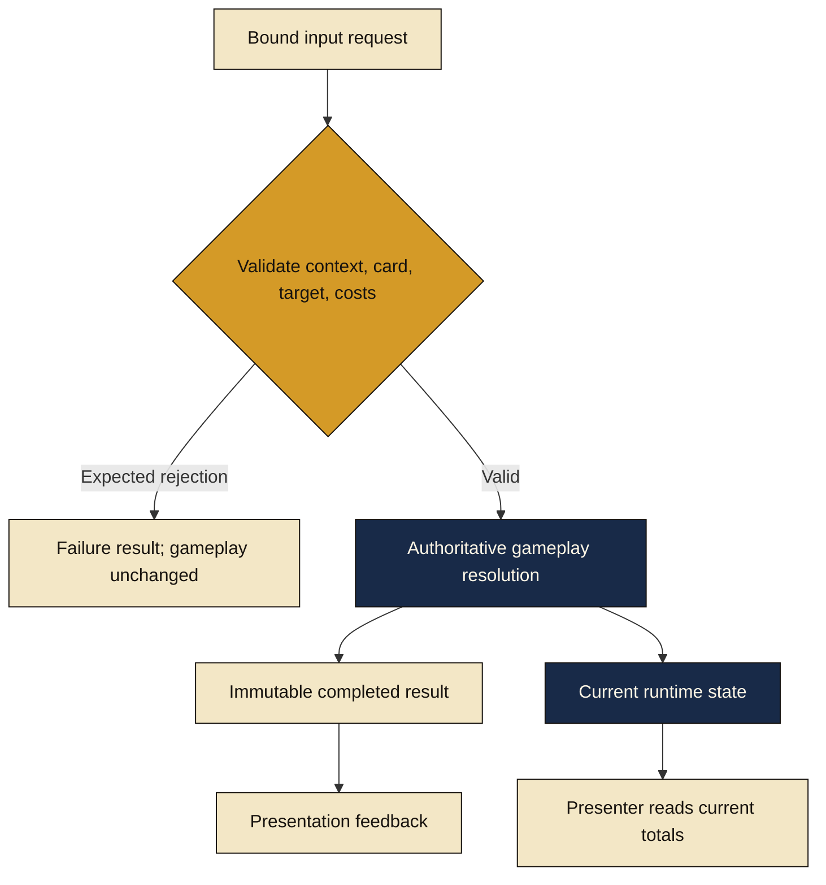

# Combat command flow

[Diagram index](README.md) · [Combat case study](../docs/COMBAT_SYSTEM_CASE_STUDY.md)

Pending selection does not spend resources. Runtime validation governs the eventual command. Completed results describe applied actions, while current state supplies HUD totals. Feedback consumes the outcome without controlling gameplay completion. This diagram omits programming/configuration exception paths and detailed rule ordering.
