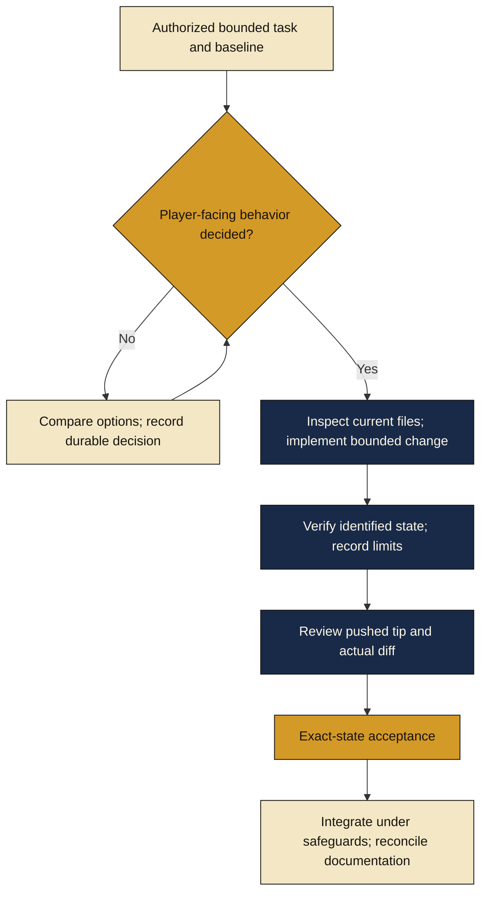

# Engineering workflow

[Diagram index](README.md) · [AI-assisted engineering](../docs/AI_ASSISTED_ENGINEERING.md)

The workflow separates a product decision, a candidate implementation, verification, review, and acceptance. Any unresolved discrepancy pauses affected progression for reconciliation. This is a high-level policy diagram; it does not certify execution of a particular private ticket or publish its internal records.
