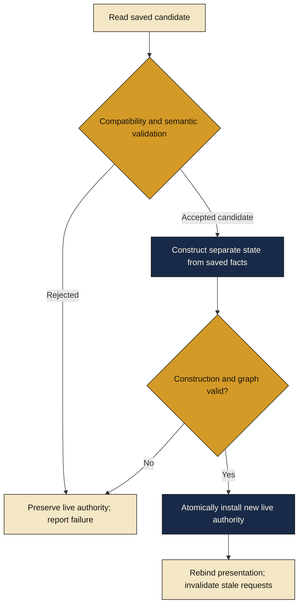

# Restore flow

[Diagram index](README.md) · [Persistence case study](../docs/PERSISTENCE_CASE_STUDY.md)

Candidate work is separate from the live session. Failure replaces nothing. Successful installation preserves saved facts and establishes fresh live bindings. Normal initialization, reward decisions, shuffling, and settlement are not replayed during this path. The diagram describes live-state installation, not a disk-format or filesystem algorithm.
