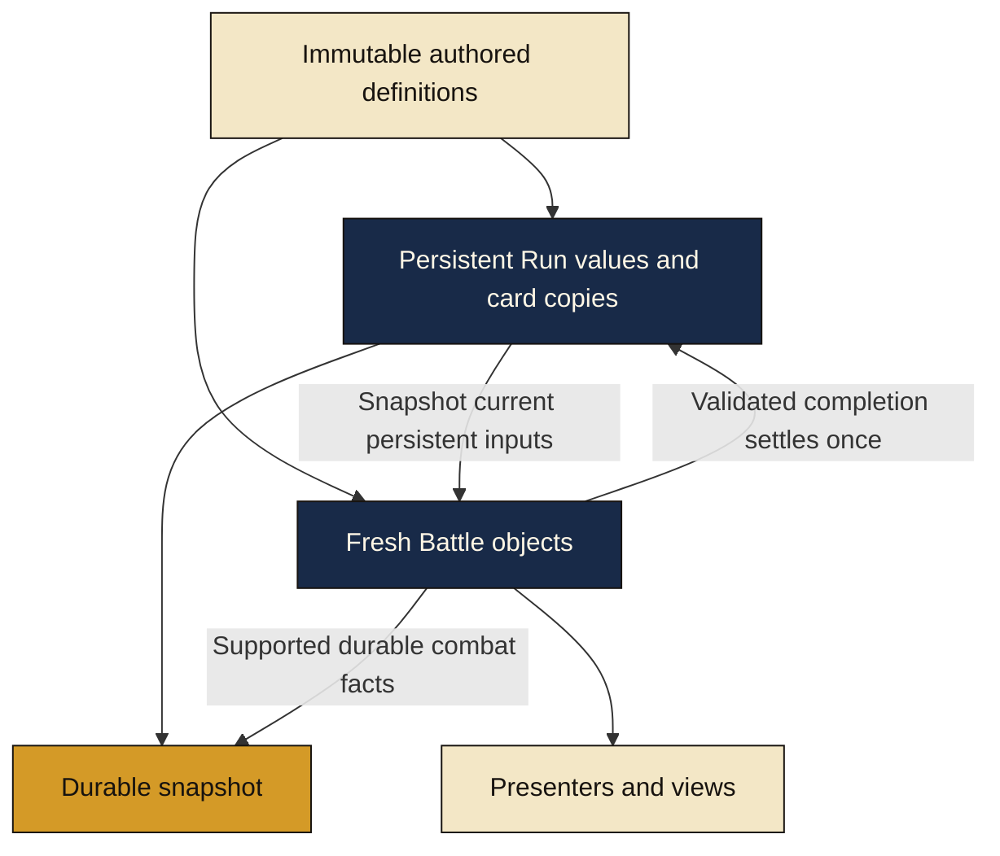

# State lifetimes

[Diagram index](README.md) · [Architecture](../docs/ARCHITECTURE.md)

Definitions may be shared. Mutable combat objects are recreated at fresh Battle boundaries. The Run owns persistent values and copies; a validated completion commits health once. Supported Run and combat facts can be captured together without retaining Unity views or old live object references.
